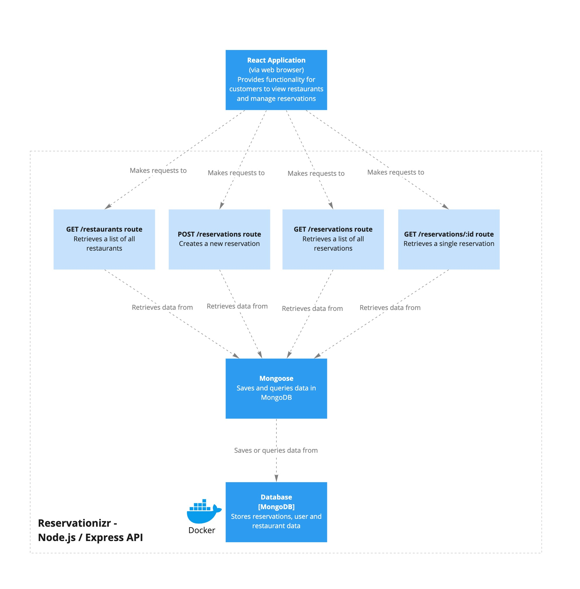
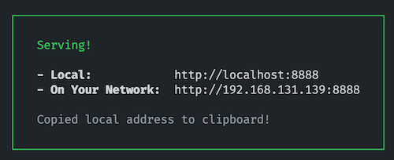

# Reservationizr - Manage Restaurant Reservations

<!-- PROJECT LOGO -->
 

  

  <h3 align="center">Reservationizr</h3>

  

    Restaurant Reservation Appliction
     
     
     
  

<!-- TABLE OF CONTENTS -->

  
Table of Contents

  <ol>
    <li><a href="#overview">Overview</a></li>
    <li><a href="#built-with">Built With</a></li>
    <li><a href="#getting-started">Getting Started</a>
          <ul>
        <li><a href="#client">Client</a></li>
        <li><a href="#server">Server</a></li>
        <li><a href="#mongodb-database">MongoDB Database</a></li>
      </ul></li>
    <li><a href="#architecture-diagrams">Architecture Diagrams</a></li>
    <li><a href="#api-specification">API Specification</a></li>
    <li><a href="#view-the-application">View The Application</a></li>
    <li><a href="#notes">Notes</a></li>
  </ol>

# Overview

Reservationizr allows customers to make reservations at any of their local restaurants from one place. It is a client server application where a user can see a list of restaurants, click and make a reservation. The user needs to be authenticated in order to make the reservation. Restarant and Reservation data is stored in a No-SQL MongoDB database. A user can view their reservations.

### Built With

Key frameworks and technologies used in this project are:

- [Javascript / CSS / HTML](https://developer.mozilla.org) - Relevant to client and server components
- [React](https://reactjs.org/) - Main Client Application Code Base
- [Node](https://nodejs.org/) - Server Javascript application enviornment
- [Express](http://expressjs.com/) - Fast, unopinionated, minimalist web framework for Node.js
- [MongoDb](https://www.mongodb.com/) - NoSQL database (to be implemented)
- [Jest](https://jestjs.io/) - Testing enviornment
- [SuperTest](https://www.npmjs.com/package/supertest) - High-level abstraction for testing HTTP
- [Netlify](https://www.netlify.com/) - Web Site public hosting service
- [Auth0](https://auth0.com/) - An easy to implement, adaptable authentication and authorization platform.

# Getting started

The `client` folder contains the React Application, and the `server` folder contains the Express application.

## Client

- In a new Terminal window, type: `cd client` to change directory into the client folder
- Type `npm install` to install npm dependencies
- Type `npm start` to start the React Application

## Server

- In a new Terminal window, type: `cd server` to change directory into the server folder
- Type `npm install` to install npm dependencies
- Type `npm start` to start the Express Server

## MongoDB Database

- In a new Terminal, type `docker-compose up` to start the MongoDB server in a Docker container
- Connect to MongoDB using [MongoDB Compass](https://www.mongodb.com/products/compass). Create a database named `mongo`, a collection named `restaurants`, and load data from the [data](./data) folder into the database.

---

# Architecture diagrams

---

# API specification

To view the documentation for the API specification:

1. Open a Terminal in VS Code for this project
2. Type `cd server` to change directory into the server folder
3. Type `npm run docs` to start a web server with API documentation
4. Open the link displayed in your browser (it's automatically copied to your clipboard)

   

---

### View The Application

The application has been deployed in production to: https://reservationizr-ws.netlify.app/

---

# Notes

- **Note:** when authenticated, the user's id is stored on `req.user.sub` in the Express route handler.
- **Note** [react-datepicker](https://github.com/Hacker0x01/react-datepicker) is used for the Date input
